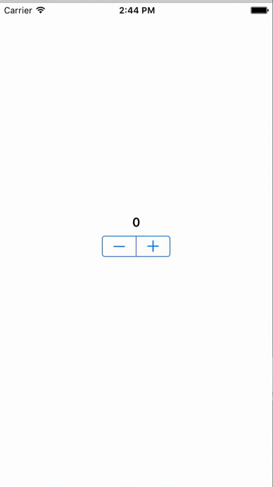

# A First Application

This repository contains Pretty Swift's course materials for [Part 4: A First Application](http://www.prettyswift.co/lessons/first-application/)/

## Exercises

## Project: A Simple Counter

Modify the project template "Counter" to create a simple counter app as shown below.

### Requirements
1. The screen should show the current value of the counter.
2. The minimum value for the counter is -10. The maximum value for the counter is 10.
3. The label showing the counter's current value should turn red when the value is negative, green when the value is positive, and black when the value is zero.
4. The "Counter" project should build without warnings when you are finished.
